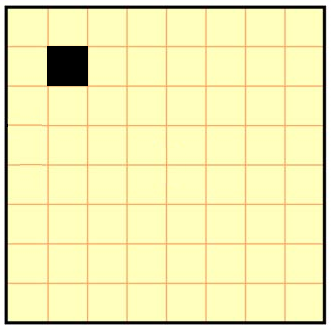
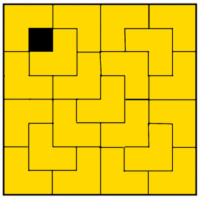

# L-Shape Tiling Problem
The Problem: Fill a square matrix with L-shaped tiles

## Description
Given a matrix of size 2^n (where n is natural number; n = (1, 2, 3, 4, ...}) and a single colored cell, you have to fill it with L-shaped tiles. The tiles should not overlapp each other or extend from the boundaries of the matrix.

## Example
####Example Starting State:
Given the following matrix with a single painted cell:

#### Possible Solution:
One of the solutions is illustrated in the following image:

## The Algorithm
The algorithm to solve this problem is a classic dividee-and-conquer where in each step we 'break' the matrix into four matrixes (hence the 2^n size restriction) and checking each matrix. we paint the three matrixes that don't have a cell with the next L-shaped tile.
